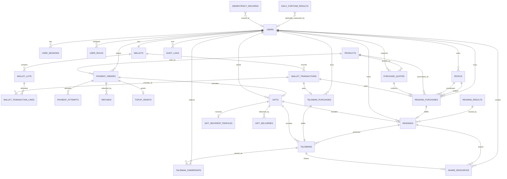

# 뿌기사주 ERD

> 버전: Draft v0.1
> 작성일: 2026-10-02
> 대상: Spring Boot 3 + PostgreSQL
> 참조: [`PRD.md`](./PRD.md), [`FUNCTIONAL_SPEC.md`](./FUNCTIONAL_SPEC.md), [`API_SPEC.md`](./API_SPEC.md), [`PENDING_DECISIONS.md`](./PENDING_DECISIONS.md)

## 1. 설계 원칙

- 외부에 노출하는 주요 리소스 식별자는 UUID를 사용한다.
- DB 시각은 `timestamptz`와 UTC로 저장하고, 수능일·유효기간 등 서비스 날짜 의미는 `Asia/Seoul`로 계산한다.
- 이름, 생년월일시, 휴대전화번호, 선물 메시지 등 개인정보는 로그·분석 이벤트에 남기지 않는다.
- 생년월일시와 휴대전화번호는 애플리케이션 계층에서 암호화해 저장한다. 검색·중복 탐지가 필요하면 원문 대신 별도 HMAC 지문을 사용한다.
- 등껍질 잔액은 조회용 집계값이고, 금전성 사실의 원본은 수정하지 않는 원장과 lot이다.
- 결제·재화·외부 호출은 하나의 DB 트랜잭션으로 묶지 않는다. 상태 머신, 멱등성, outbox, 보상 거래로 정합성을 맞춘다.
- 구매 당시 인물·가격·결과·버전을 스냅샷으로 보존한다. 원본 프로필이나 상품이 바뀌어도 과거 결과는 바꾸지 않는다.
- 선물은 단건만 지원한다. 일자별 공개, 회차, 스케줄 테이블은 만들지 않는다.
- JSONB는 계산 결과·결과 섹션·가격 스냅샷처럼 버전이 붙는 문서 데이터에만 사용한다. 관계·상태·금액·소유권은 정규 컬럼으로 둔다.

## 2. 전체 관계 요약

관계선은 핵심 소유·참조만 표시한다. `READINGS`의 `purchase_id`와 `gift_id`는 둘 중 하나만 존재해야 한다. `SHARE_RESOURCES`도 `reading_id`와 `talisman_id` 중 하나만 존재해야 한다.

## 3. 테이블 명세

### 3.1 회원·인증·인물

#### `users`

| 컬럼 | 타입 | 제약/설명 |
|---|---|---|
| `id` | uuid | PK |
| `kakao_subject` | varchar(100) | UNIQUE, 카카오 회원 식별자 |
| `nickname` | varchar(50) | nullable |
| `status` | varchar(20) | `ACTIVE`, `WITHDRAWAL_PENDING`, `WITHDRAWN`, `BLOCKED` |
| `created_at`, `updated_at` | timestamptz | 필수 |
| `withdrawal_requested_at`, `deleted_at` | timestamptz | nullable |

카카오 access token 원문은 저장하지 않는다. 필요한 경우 암호화된 refresh token과 범위를 별도 자격증명 저장소에 둔다.

#### `user_sessions`

| 컬럼 | 타입 | 제약/설명 |
|---|---|---|
| `id` | uuid | PK, 쿠키에는 원문 대신 무작위 세션 토큰 사용 |
| `user_id` | uuid | FK → `users.id` |
| `token_hash` | char(64) | UNIQUE, 세션 원문 미저장 |
| `csrf_secret_hash` | char(64) | CSRF 검증용 |
| `device_label`, `ip_prefix`, `user_agent_summary` | varchar | 최소 정보만 저장 |
| `expires_at`, `last_seen_at`, `revoked_at` | timestamptz | 세션 수·만료 관리 |

활성 세션은 사용자당 최대 5개다. 초과 시 처리 정책은 `TBD(I-02)`가 확정되기 전까지 자동 퇴출하지 않는다.

#### `user_roles`

`(user_id, role)` 복합 PK. `role`은 `USER`, `CS`, `ADMIN`이며 관리자 권한 변경도 감사 로그 대상이다.

#### `people`

| 컬럼 | 타입 | 제약/설명 |
|---|---|---|
| `id` | uuid | PK |
| `owner_user_id` | uuid | FK → `users.id` |
| `profile_type` | varchar(20) | `SELF`, `OTHER` |
| `display_name_enc` | bytea | 암호화 |
| `birth_date_enc`, `birth_time_enc` | bytea | 암호화, 시간 미상 시 `birth_time_enc` null |
| `calendar_type` | varchar(10) | `SOLAR`, `LUNAR` |
| `is_leap_month`, `birth_time_unknown` | boolean | 입력 규칙과 CHECK 적용 |
| `gender`, `relation_type` | varchar | 문서 enum 사용 |
| `birth_fingerprint` | char(64) | 사용자별 HMAC, 중복 경고용 |
| `third_party_confirmed_at` | timestamptz | 타인 입력 권한 확인 시각 |
| `created_at`, `updated_at`, `deleted_at` | timestamptz | soft delete |

주요 제약:

- 사용자별 활성 `SELF` 프로필은 최대 1개인 partial UNIQUE index를 둔다.
- 활성 `OTHER`는 최대 10개이며 서비스 계층과 잠금된 카운트 쿼리로 검증한다.
- `birth_time_unknown=true`이면 `birth_time_enc IS NULL`이어야 한다.
- `calendar_type='SOLAR'`이면 `is_leap_month=false`여야 한다.

### 3.2 상품·견적

#### `products`

| 컬럼 | 타입 | 설명 |
|---|---|---|
| `id` | uuid | PK |
| `code` | varchar(80) | UNIQUE, 외부 계약에 사용하는 안정 코드 |
| `category` | varchar(30) | `TOP_UP`, `READING`, `GIFT`, `TALISMAN_ADDON` |
| `fortune_type` | varchar(30) | 일반 5종 또는 `SUNEUNG`, 충전이면 null |
| `product_option` | varchar(30) | 본인용 옵션 |
| `gift_option` | varchar(30) | 선물 옵션 |
| `price_currency` | varchar(20) | `KRW`, `TURTLE_SHELL` |
| `price_amount` | integer | 0 초과 |
| `paid_shell_amount`, `bonus_shell_amount` | integer | 충전 상품만 사용 |
| `active`, `sale_start_at`, `sale_end_at` | mixed | 판매 제어 |
| `catalog_version` | varchar(50) | 가격·구성 버전 |

허용 조합은 CHECK 또는 애플리케이션 검증으로 제한한다. 선물에는 `READING_ONLY`가 없고, 본인용에는 `TALISMAN_ONLY`가 없다.

#### `purchase_quotes`

서버가 계산한 가격과 제공물을 결제 직전 고정한다.

| 컬럼 | 타입 | 설명 |
|---|---|---|
| `id` | uuid | PK |
| `requester_user_id`, `product_id` | uuid | FK |
| `currency`, `amount` | varchar, integer | 서버 계산 가격 |
| `included_contents` | jsonb | `READING`, `TALISMAN`, `LETTER`, `SUNEUNG_CHECKLIST` |
| `context_hash` | char(64) | 인물·질문·이벤트 등 견적 입력 지문 |
| `product_snapshot` | jsonb | 상품 코드·구성·버전 |
| `expires_at`, `created_at` | timestamptz | 만료 후 사용 불가 |

### 3.3 등껍질 지갑·충전·결제

#### `wallets`

`user_id`가 PK/FK다. `paid_balance`, `bonus_balance`, `version`, `updated_at`을 가진다. 잔액은 원장 합계와 정기 대사하며 음수가 될 수 없다.

#### `wallet_lots`

등껍질의 출처·유효기간·환불 가능성을 보존한다.

| 컬럼 | 타입 | 설명 |
|---|---|---|
| `id` | uuid | PK |
| `wallet_user_id` | uuid | FK → `wallets.user_id` |
| `balance_type` | varchar(10) | `PAID`, `BONUS` |
| `source_type`, `source_id` | varchar, uuid | 충전·보상·조정 출처 |
| `granted_amount`, `remaining_amount` | integer | 0 이상 |
| `expires_at` | timestamptz | 유료 5년, 보너스 기본 180일 |
| `created_at` | timestamptz | 지급 시각 |

#### `wallet_transactions`

| 컬럼 | 타입 | 설명 |
|---|---|---|
| `id` | uuid | PK |
| `wallet_user_id` | uuid | FK |
| `type` | varchar(30) | `TOP_UP`, `PURCHASE`, `REFUND`, `EXPIRY`, `ADJUSTMENT` |
| `total_amount` | integer | 지급 양수, 차감 음수 |
| `reference_type`, `reference_id` | varchar, uuid | 주문·구매·관리자 작업 |
| `reversal_of_id` | uuid | FK → 자기 자신, 역분개 시 사용 |
| `idempotency_record_id` | uuid | UNIQUE nullable |
| `created_at` | timestamptz | 불변 |

#### `wallet_transaction_lines`

한 거래가 어떤 lot의 유료분·보너스분을 얼마나 소비하거나 복구했는지 기록한다. `(transaction_id, lot_id)`를 UNIQUE로 하고 `amount`의 부호 합이 상위 거래와 일치해야 한다.

차감 우선순위는 `TBD(P-02A)`다. 확정 전에는 로직을 상수로 고정하거나 임의 선택하지 않고 정책 인터페이스로 분리한다.

#### `payment_orders`

| 컬럼 | 타입 | 설명 |
|---|---|---|
| `id` | uuid | PK, 토스 주문 ID와 분리 |
| `user_id`, `product_id`, `quote_id` | uuid | FK |
| `order_type` | varchar(20) | `TOP_UP`, `GIFT` |
| `status` | varchar(30) | 상태 머신 참조 |
| `amount_krw` | integer | 서버 확정 금액 |
| `order_name`, `product_snapshot` | varchar, jsonb | 구매 당시 정보 |
| `provider_order_id` | varchar(100) | UNIQUE |
| `created_at`, `paid_at`, `canceled_at` | timestamptz | 상태 시각 |

#### `payment_attempts`

승인·취소 요청별 기록이다. `provider_payment_key`는 암호화하고 별도 HMAC 컬럼을 UNIQUE로 둔다. 요청 금액, 상태, provider code, 안전하게 정제한 응답, 시각을 저장하며 원문 카드·개인정보는 저장하지 않는다.

#### `topup_grants`

`payment_order_id` UNIQUE, `paid_amount`, `bonus_amount`, 두 lot FK, `credited_at`을 가진다. 같은 결제의 중복 지급을 DB 제약으로 막는다.

#### `refunds`

`payment_order_id`, `requested_by_user_id`, `amount_krw`, `status`, `reason_code`, `provider_refund_id`, `requested_at`, `completed_at`을 저장한다. 환불과 원장 회수/복구는 별도 상태로 추적한다.

### 3.4 운세 결과·부적

#### `reading_purchases`

| 컬럼 | 타입 | 설명 |
|---|---|---|
| `id` | uuid | PK |
| `buyer_user_id`, `product_id`, `quote_id` | uuid | FK |
| `subject_person_id` | uuid | 본인/대상 인물 |
| `counterpart_person_id` | uuid | 궁합만 사용 |
| `wallet_transaction_id` | uuid | UNIQUE, 차감 거래 |
| `status` | varchar(20) | `CREATED`, `DEBITED`, `GENERATING`, `FULFILLED`, `FAILED`, `REFUNDED` |
| `interest_key`, `event_type`, `event_date` | mixed | 선택형 관심사·수능 맥락 |
| `free_memo_enc` | bytea | 결과 생성에는 사용하지 않음 |
| `person_snapshot_enc` | bytea | 구매 당시 입력 암호화 스냅샷 |
| `created_at`, `fulfilled_at` | timestamptz | 상태 시각 |

#### `reading_results`

계정과 분리된 재사용 가능한 최초 성공 결과다.

| 컬럼 | 타입 | 설명 |
|---|---|---|
| `id` | uuid | PK |
| `generation_key` | char(64) | UNIQUE |
| `fortune_type`, `reference_date` | varchar, date | 결과 기준 |
| `facts_json` | jsonb | 계산 엔진의 정규화 결과; 직접 공개 금지 |
| `sections_json` | jsonb | 검증을 통과한 Liner 결과 |
| `calculation_version`, `generation_version`, `content_version` | varchar | 필수 |
| `status`, `failure_code` | varchar | `GENERATING`, `SUCCEEDED`, `FAILED` |
| `created_at`, `completed_at` | timestamptz | 생성 시각 |

`generation_key`에는 원문 개인정보를 넣지 않고 HMAC/SHA-256 결과만 저장한다. `facts_json`과 `sections_json`은 결과 접근 권한을 통해서만 조회한다.

#### `readings`

사용자 또는 선물 수신자에게 부여된 결과 인스턴스다.

| 컬럼 | 타입 | 설명 |
|---|---|---|
| `id` | uuid | PK |
| `reading_result_id` | uuid | FK → `reading_results.id` |
| `owner_user_id` | uuid | 본인 구매일 때 FK, 선물은 nullable |
| `purchase_id` | uuid | UNIQUE nullable |
| `gift_id` | uuid | UNIQUE nullable |
| `fortune_type`, `option` | varchar | 조회 최적화·스냅샷 |
| `public_snapshot` | jsonb | 화면 반환용 섹션·고지·버전 |
| `created_at` | timestamptz | 생성 시각 |

CHECK: `(purchase_id IS NOT NULL) <> (gift_id IS NOT NULL)`.

#### `daily_fortune_results`

비로그인 오늘의 운세를 같은 인물·같은 날짜에 동일하게 반환하기 위한 결과 cache다.

| 컬럼 | 타입 | 설명 |
|---|---|---|
| `id` | uuid | PK |
| `generation_key` | char(64) | UNIQUE, 정규화 입력 HMAC + KST 날짜 + 버전 |
| `requester_user_id` | uuid | 로그인 요청이면 nullable FK |
| `fortune_date` | date | `Asia/Seoul` 기준 날짜 |
| `result_json` | jsonb | 한줄·색·아이템·장소·행동 |
| `calculation_version`, `generation_version`, `content_version` | varchar | 생성 당시 버전 |
| `created_at`, `expires_at` | timestamptz | cache 관리 |

원본 생년정보는 저장하지 않는다. 익명 요청을 계정·기기와 연결하는 영구 식별자도 저장하지 않으며, 브라우저 입력 보관은 프론트 localStorage의 30일 정책을 따른다.

#### `generation_attempts`

`reading_result_id`, `attempt_no`, `provider`, `input_hash`, `status`, `latency_ms`, `error_code`, `started_at`, `ended_at`을 저장한다. 원본 생년정보와 Liner 전체 prompt/response는 운영 로그에 기록하지 않는다.

#### `talisman_purchases`

결과 후 15 등껍질 추가 구매를 나타낸다. `user_id`, `reading_id`, `wallet_transaction_id`(UNIQUE), `status`, `created_at`을 가진다.

#### `talismans`

| 컬럼 | 타입 | 설명 |
|---|---|---|
| `id` | uuid | PK |
| `reading_id`, `gift_id`, `talisman_purchase_id` | uuid | 생성 출처, 허용 조합 CHECK |
| `type`, `zodiac_animal`, `element` | varchar | 카탈로그 선택 결과 |
| `status` | varchar(10) | `PENDING`, `READY`, `FAILED` |
| `original_object_key`, `thumbnail_object_key`, `share_object_key` | varchar | R2 key, 공개 URL 저장 금지 |
| `asset_version`, `created_at`, `ready_at` | mixed | 에셋 버전·시각 |

#### `talisman_ownerships`

`(user_id, talisman_id)` UNIQUE. `source`는 `PURCHASE`, `GIFT_CLAIM`; `acquired_at`을 가진다. 비로그인 선물 수신자는 선물 토큰으로 열람하고 로그인 후 claim할 때 이 행을 만든다.

### 3.5 선물·알림톡

#### `gifts`

| 컬럼 | 타입 | 설명 |
|---|---|---|
| `id` | uuid | PK |
| `payment_order_id` | uuid | UNIQUE FK |
| `purchaser_user_id`, `product_id` | uuid | FK |
| `fortune_type`, `gift_option` | varchar | 단건 상품 스냅샷 |
| `recipient_name_enc`, `recipient_phone_enc` | bytea | 암호화 |
| `recipient_phone_hmac` | char(64) | 재발송/감사 식별용, 원문 검색 금지 |
| `sender_name_enc`, `message_enc` | bytea | 암호화, 최대 200자 |
| `token_hash` | char(64) | UNIQUE, 원문 미저장 |
| `status` | varchar(30) | 상태 머신 참조 |
| `expires_at`, `opened_at`, `completed_at`, `revoked_at` | timestamptz | 상태 시각 |

미사용 링크 만료와 제공 개시 기준은 각각 `TBD(G-07)`, `TBD(G-09)`다.

#### `gift_recipient_profiles`

`gift_id`가 PK/FK다. 수신자가 제출한 `display_name_enc`, `birth_date_enc`, `birth_time_enc`, `calendar_type`, `is_leap_month`, `birth_time_unknown`, `gender`, `submitted_at`, `locked_at`, `reset_at`을 저장한다. 선물 이용 종료 90일 후 삭제 대상이며 입력 초기화는 감사 로그를 남긴다.

#### `gift_deliveries`

| 컬럼 | 타입 | 설명 |
|---|---|---|
| `id` | uuid | PK |
| `gift_id` | uuid | FK |
| `purpose` | varchar(20) | `INITIAL`, `RESEND`, `REISSUE` |
| `channel` | varchar(20) | `KAKAO_ALIMTALK` |
| `status` | varchar(20) | `PENDING`, `SENT`, `FAILED` |
| `provider_message_id`, `template_code` | varchar | 대행사 식별 정보 |
| `attempt_count`, `last_error_code` | mixed | 재시도 추적 |
| `requested_at`, `sent_at`, `failed_at` | timestamptz | 상태 시각 |

#### `outbox_events`

결제 승인 후 알림톡 발송, 결과 생성 등 외부 작업을 DB 커밋과 안전하게 연결한다. `aggregate_type`, `aggregate_id`, `event_type`, `payload_enc`, `status`, `attempt_count`, `available_at`, `expires_at`, `processed_at`을 가진다. 선물 원문 URL은 `payload_enc`에만 저장하고 발송 성공 또는 재시도 종료 후 즉시 비운다.

### 3.6 공유·운영

#### `share_resources`

| 컬럼 | 타입 | 설명 |
|---|---|---|
| `id` | uuid | PK, 추측 불가능한 공개 식별자 |
| `owner_user_id` | uuid | FK |
| `reading_id`, `talisman_id` | uuid | 둘 중 하나만 존재 |
| `public_payload` | jsonb | 비식별 제목·설명·허용 output·CTA |
| `image_object_key` | varchar | 개인정보 없는 공유 이미지 |
| `status` | varchar(20) | `ACTIVE`, `REVOKED`, `EXPIRED` |
| `expires_at`, `revoked_at`, `created_at` | timestamptz | 정책 시각 |

공유 범위·만료·철회는 `TBD(G-11)`이므로 스키마는 수용하되 기본값을 임의 확정하지 않는다.

#### `content_versions`

`id`, `kind`(`CALCULATION`, `GENERATION`, `CATALOG`), `version`, `status`(`DRAFT`, `REVIEW`, `APPROVED`, `DEPLOYED`, `ROLLED_BACK`), `artifact_hash`, `deployed_by`, `deployed_at`을 가진다.

#### `idempotency_records`

| 컬럼 | 타입 | 설명 |
|---|---|---|
| `id` | uuid | PK |
| `actor_type`, `actor_id` | varchar, uuid | 사용자·선물 토큰 지문·시스템 |
| `operation` | varchar(80) | 명령 종류 |
| `idempotency_key` | varchar(100) | 요청 키 |
| `request_hash` | char(64) | 본문 지문 |
| `status` | varchar(20) | `PROCESSING`, `SUCCEEDED`, `FAILED` |
| `response_status`, `response_body` | integer, jsonb | 안전한 최초 응답 |
| `resource_type`, `resource_id` | varchar, uuid | 생성 리소스 |
| `expires_at`, `created_at`, `completed_at` | timestamptz | 보관 시각 |

UNIQUE: `(actor_type, actor_id, operation, idempotency_key)`.

#### `audit_logs`

`actor_user_id`, `actor_role`, `action`, `target_type`, `target_id`, `reason`, `before_summary`, `after_summary`, `request_trace_id`, `created_at`을 저장한다. 생년정보·전화번호·토큰·결과 본문은 감사 로그에도 기록하지 않는다.

## 4. 핵심 상태 머신

| 대상 | 정상 흐름 | 예외/종료 |
|---|---|---|
| 충전 주문 | `CREATED → PAYMENT_PENDING → PAID → CREDITED` | `FAILED`, `CANCELED`, `REFUNDED` |
| 본인 구매 | `CREATED → DEBITED → GENERATING → FULFILLED` | `FAILED → REFUNDED` |
| 선물 주문 | `CREATED → PAYMENT_PENDING → PAID → ACTIVE → COMPLETED` | `CANCELED`, `REFUNDED`, `EXPIRED` |
| 선물 수신 | `UNCLAIMED → RECIPIENT_SUBMITTED → ACTIVE → COMPLETED` | `EXPIRED`, 기존 토큰 `REVOKED` |
| 알림톡 | `PENDING → SENT` | `FAILED` |
| 부적 | `PENDING → READY` | `FAILED` |

상태 변경은 조건부 UPDATE 또는 행 잠금으로 이전 상태를 검증한 뒤 수행한다. 이미 종료된 상태를 다시 변경하면 `INVALID_STATE`다.

## 5. 필수 인덱스·제약

- 모든 FK 컬럼에 인덱스를 둔다.
- `users(kakao_subject)`, `user_sessions(token_hash)`, `products(code)`, `payment_orders(provider_order_id)`, `reading_results(generation_key)`, `gifts(token_hash)`는 UNIQUE다.
- 목록 API용 인덱스:
  - `readings(owner_user_id, created_at DESC, id DESC)`
  - `daily_fortune_results(fortune_date, created_at DESC)`
  - `talisman_ownerships(user_id, acquired_at DESC, id DESC)`
  - `payment_orders(user_id, created_at DESC, id DESC)`
  - `gifts(purchaser_user_id, created_at DESC, id DESC)`
  - `wallet_transactions(wallet_user_id, created_at DESC, id DESC)`
- 작업자 조회용 partial index:
  - `outbox_events(status, available_at) WHERE status IN ('PENDING','RETRY')`
  - `gift_deliveries(status, requested_at) WHERE status='PENDING'`
- 금액·수량은 `integer`와 `CHECK (value >= 0)`를 사용한다. KRW 소수점 금액은 지원하지 않는다.
- 전화번호, 세션, 선물 토큰의 원문에는 UNIQUE/검색 인덱스를 만들지 않고 HMAC/hash 컬럼을 사용한다.

## 6. 트랜잭션 경계

### 본인 운세 구매

1. 사용자·견적·인물 소유권을 검증한다.
2. 지갑 행을 잠그고 lot 정책에 따라 원장 차감, 구매 `DEBITED`를 한 트랜잭션으로 커밋한다.
3. `generation_key`의 성공 결과가 있으면 재사용한다. 없으면 계산 엔진 → Liner → 응답 검증을 수행한다.
4. 성공 시 `reading_results`, `readings`, 구매 `FULFILLED`를 커밋한다.
5. 최종 실패 시 별도 보상 트랜잭션으로 원장을 역분개하고 구매를 `REFUNDED`로 만든다.

### 등껍질 충전

1. 서버 상품 가격으로 주문을 만든다.
2. 토스 승인 요청 전후의 시도와 금액을 기록한다.
3. 승인 성공 후 한 트랜잭션에서 유료/보너스 lot, 원장, 잔액, `topup_grants`를 생성한다.
4. `topup_grants.payment_order_id` UNIQUE로 중복 지급을 막는다.

### 선물 결제·전달

1. 토스 승인과 서버 금액 일치 검증 후 `payment_orders=PAID`, `gifts=ACTIVE`, 알림톡 outbox를 커밋한다.
2. 작업자가 암호화 payload를 복호화해 알림톡을 보내고 `gift_deliveries`를 갱신한다.
3. 발송 실패는 선물 결제·활성 상태를 되돌리지 않고 재시도/CS 대상으로 남긴다.
4. 링크 재발급은 새 token hash 저장과 기존 토큰 폐기를 원자적으로 처리한 뒤 새 전달 작업을 만든다.

### 선물 수신

1. token hash로 선물을 조회하고 상태·만료를 검증한다.
2. 최초 수신자 입력을 잠금 저장한다. 동일 멱등 요청에는 최초 결과를 반환한다.
3. 필요한 단건 결과와 부적을 생성하고 gift에 연결한다.
4. `TALISMAN_ONLY` 수능 선물은 편지·부적·체크리스트만 만들고 전체 reading은 만들지 않는다.

## 7. 삭제·보관

| 데이터 | 처리 |
|---|---|
| 회원·인물·개인 결과 | 탈퇴 후 최대 30일 내 삭제 |
| 법정 결제·계약 기록 | 일반 개인정보와 논리 분리, 법정 기간 보관 |
| 비회원 선물 수신자 정보 | 선물 이용 종료 90일 후 삭제 |
| 알림톡 전화번호 | `TBD(G-10A)` 확정 후 삭제 job 적용 |
| outbox의 원문 선물 URL | 발송 성공 또는 재시도 보관기간 종료 즉시 삭제 |
| 공유 리소스 | 철회·만료 시 공개 차단, 보관기간은 `TBD(G-11)` |
| 감사 로그 | 운영·법무 보관정책에 따라 보존하되 민감 원문 미기록 |

물리 삭제가 법정 거래 FK를 깨뜨리면 사용자 FK를 null 처리하고 거래 당시 비식별 상품·금액 스냅샷만 남긴다.

## 8. 구현 전 확정이 필요한 항목

- 유료/보너스 등껍질 차감 우선순위와 일부 환불 산식
- 선물 원화 가격, 미사용 링크 만료, 제공 개시·환불 기준
- 알림톡 대행사, 재시도 횟수, SMS 대체 여부, 전화번호 보관기간
- 신살 결과·부적 스키마
- 자시·역법·띠 경계 및 만세력 라이브러리
- 부적 동기/비동기 생성 방식
- 개인 output 공유 범위·만료·철회 정책

위 항목은 컬럼 수용성만 확보하고 기본값이나 업무 규칙을 임의 구현하지 않는다.
